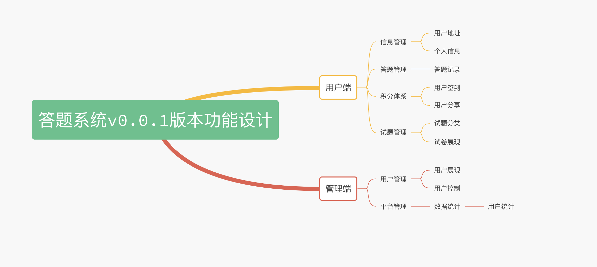

## 文档说明

### 项目介绍

在线考试系统是依托于微信小程序环境下的一款答题小程序。项目分为个人版和平台版本，当前预览版本为个人版本，个人版本也逐步更新中。

### 项目预览


### 项目功能图



### 环境要求
```php
>=php7.4
>=mysql5.7
>=redis5.0
>=swoole4.5(具体的要求根据Laravels决定)
```

### 项目部署

1. 克隆对应的代码版本。

2. 执行`composer install`安装composer依赖包。

### 参数配置

1. 复制.env.examp文件为.env文件。

2. 设置MySQL配置。
```php
DB_CONNECTION=mysql
DB_HOST=192.168.2.103
DB_PORT=3304
DB_DATABASE=exam_wechat
DB_USERNAME=root
DB_PASSWORD=123456
DB_PREFIX=exam_
```

3. 设置Redis配置。
```php
REDIS_CLIENT=phpredis
REDIS_HOST=redis
REDIS_PASSWORD=null
REDIS_PORT=6379
REDIS_PREFIX=exam:
```

4. 设置微信小程序配置。
```php
WX_APPID=
WX_SECRET=
```

5. 设置七牛云存储配置。
```php
QINIU_URI=
QINIU_ACCESSS_KEY=
QINIU_SECRET_KEY=
QINIU_BUCKET=document-bruce
QINIU_AGREEMENT=http
QINIU_DMOAIN=http://xxx.xxx.com/
```

6. 设置laravelS配置。
```php
LARAVELS_LISTEN_IP=0.0.0.0
LARAVELS_LISTEN_PORT=9501
```

7. 将对应的sql文件导出到已经创建好的MySQL服务中。